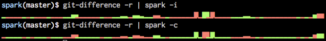

# color spark
### sparklines for your shell

See? Here's a graph of your productivity gains after using spark: ▁▂▃▅▇

## install

spark is a [shell script][bin], so drop it somewhere and make sure it's added
to your `$PATH`. It's helpful if you have a super-neat collection of dotfiles,
[like mine][dotfiles].

If you're on OS X, spark is also on [Homebrew][brew]:

    brew install spark

## usage

Just run `spark` and pass it a list of numbers (comma-delimited, spaces,
whatever you'd like). It's designed to be used in conjunction with other
scripts that can output in that format.

    spark 0 30 55 80 33 150
    ▁▂▃▅▂▇

Invoke help with `spark -h`.

## Why this flavor

I just wanted to add some color, so there are 2 new options and a behavior 
change: it will measure size on absolute value, and you can specify if you
want regular green/red for positive/negative value, or inverted colors:

Here is an example using the [git-difference](https://github.com/pcarranza/dotfiles/blob/master/bin/git-difference) 
script there is in my dotfiles project

And I do not want to ruin the original simplicity of the code, spark is great as it originally is, 
this is just a subproduct out of it.
